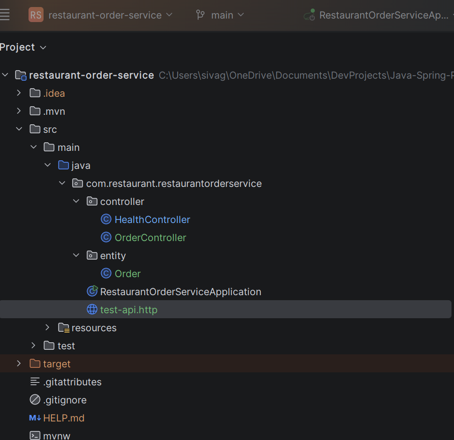
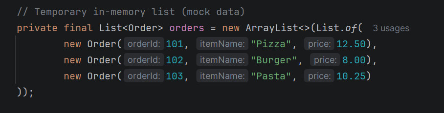
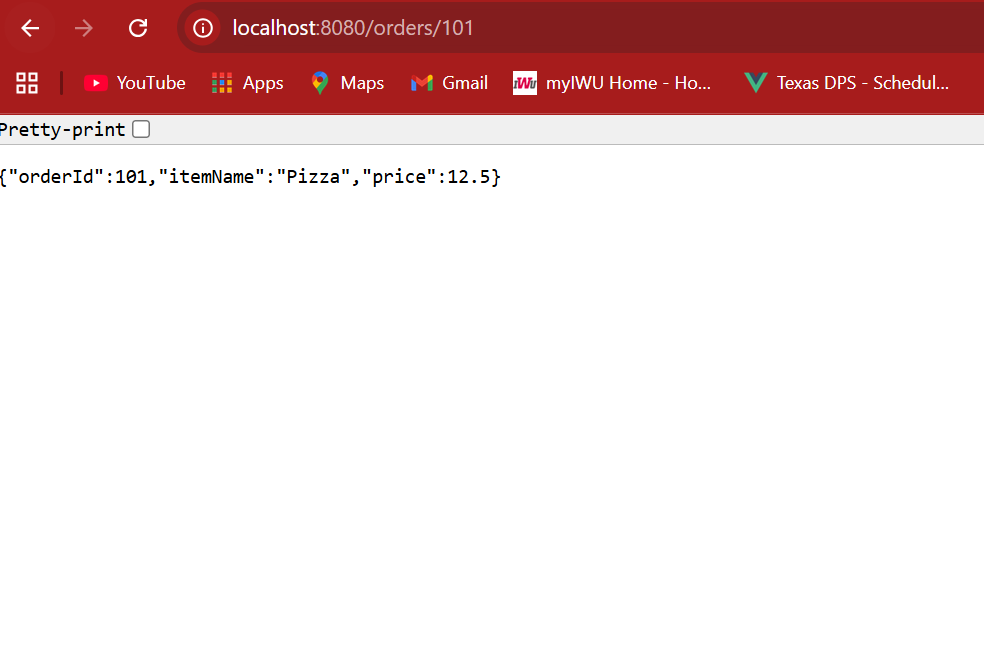

# Restaurant Order Service

Spring Boot REST API for managing restaurant orders.

## Tech Stack

- Java 21
- Spring Boot
- Maven
- REST APIs
- JSON

---

## API Endpoints

GET /health

GET /orders

GET /orders/{id}

POST /orders

---

## Screenshots

### Project Structure

### Orders API Response

### Single Order API

---

## Run the Project

Clone the repository

git clone https://github.com/sivaganesh1407/restaurant-order-service.git

Run the application

mvn spring-boot:run

Open in browser

http://localhost:8080/orders